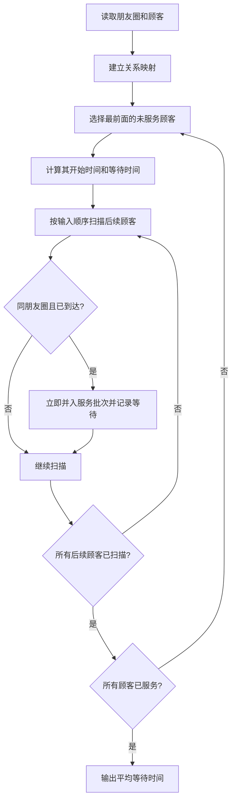
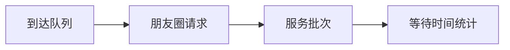

# 7-48 银行排队问题之单窗口“夹塞”版

- **分值：** 30分

## 题目描述

排队“夹塞”是引起大家强烈不满的行为，但是这种现象时常存在。在银行的单窗口排队问题中，假设银行只有1个窗口提供服务，所有顾客按到达时间排成一条长龙。当窗口空闲时，下一位顾客即去该窗口处理事务。此时如果已知第$$i$$位顾客与排在后面的第$$j$$位顾客是好朋友，并且愿意替朋友办理事务的话，那么第$$i$$位顾客的事务处理时间就是自己的事务加朋友的事务所耗时间的总和。在这种情况下，顾客的等待时间就可能被影响。假设所有人到达银行时，若没有空窗口，都会请求排在最前面的朋友帮忙（包括正在窗口接受服务的朋友）；当有不止一位朋友请求某位顾客帮忙时，该顾客会根据自己朋友请求的顺序来依次处理事务。试编写程序模拟这种现象，并计算顾客的平均等待时间。

## 输入格式

输入的第一行是两个整数：$$1\le N \le 10000$$，为顾客总数；$$0 \le M \le 100$$，为彼此不相交的朋友圈子个数。若$$M$$非0，则此后$$M$$行，每行先给出正整数$$2\le L \le 100$$，代表该圈子里朋友的总数，随后给出该朋友圈里的$$L$$位朋友的名字。名字由3个大写英文字母组成，名字间用1个空格分隔。最后$$N$$行给出$$N$$位顾客的姓名、到达时间$$T$$和事务处理时间$$P$$（以分钟为单位），之间用1个空格分隔。简单起见，这里假设顾客信息是按照到达时间先后顺序给出的（有并列时间的按照给出顺序排队），并且假设每个事务最多占用窗口服务60分钟（如果超过则按60分钟计算）。

## 输出格式

按顾客接受服务的顺序输出顾客名字，每个名字占1行。最后一行输出所有顾客的平均等待时间，保留到小数点后1位。

## 输入样例
```
6 2
3 ANN BOB JOE
2 JIM ZOE
JIM 0 20
BOB 0 15
ANN 0 30
AMY 0 2
ZOE 1 61
JOE 3 10

```

## 输出样例
```
JIM
ZOE
BOB
ANN
JOE
AMY
75.2

```

**鸣谢用户 陈君伟 补充数据！**

### 实现原理与解题思路

按到达顺序维护顾客队列和朋友圈关系。服务窗口空闲时取队首；若后续顾客请求队首朋友代办，则将其事务按请求顺序并入该朋友的服务批次。服务时间使用 `min(P,60)`，每位顾客的等待时间为开始服务时刻减到达时刻。

### 代码流程说明

预先建立姓名到朋友圈编号的映射。每次选取最前面的未服务顾客，按输入顺序扫描后续顾客，将尚未服务、同朋友圈且已到达的顾客按请求顺序并入当前服务批次，同时分别累加等待时间。最坏时间复杂度为 `O(N²+M)`，空间复杂度 `O(N+M)`。

### 代码实现

```cpp
// 实现原理：
// 按到达顺序维护顾客队列和朋友圈关系。服务窗口空闲时取队首；若后续顾客请求队首朋友代办，则将其事务按请求顺序并入该朋友的服务批次。服务时间使用 `min(P,60)`，
// 每位顾客的等待时间为开始服务时刻减到达时刻。
// 处理流程：
// 预先建立姓名到朋友圈编号的映射。每次选取最前面的未服务顾客，按输入顺序扫描后续顾客，将尚未服务、同朋友圈且已到达的顾客按请求顺序并入当前服务批次，同时分别累加等待时间。最坏时间复杂度为
// `O(N²+M)`，空间复杂度 `O(N+M)`。
#include <algorithm>
#include <iomanip>
#include <iostream>
#include <string>
#include <unordered_map>
#include <vector>
using namespace std;
struct Customer {
    string name;
    int arrive, service, group = 0;
};
int main() {
    ios::sync_with_stdio(false);
    cin.tie(nullptr);
    int n, m;
    cin >> n >> m;
    unordered_map<string, int> group;
    for (int g = 1; g <= m; ++g) {
        int k;
        cin >> k;
        while (k--) {
            string name;
            cin >> name;
            group[name] = g;
        }
    }
    vector<Customer> a(n);
    for (auto& x : a) {
        cin >> x.name >> x.arrive >> x.service;
        x.service = min(x.service, 60);
        if (group.count(x.name))
            x.group = group[x.name];
    }
    vector<bool> served(n, false);
    long long totalWait = 0;
    int finish = 0;
    for (int i = 0; i < n;) {
        while (i < n && served[i])
            ++i;
        if (i == n)
            break;
        int g = a[i].group;
        int j = i;
        do {
            if (served[j] || (j != i && a[j].group != g)) {
                ++j;
                continue;
            }
            int start = max(finish, a[j].arrive);
            totalWait += start - a[j].arrive;
            cout << a[j].name << '\n';
            finish = start + a[j].service;
            served[j] = true;
            ++j;
        } while (g != 0 && j < n && a[j].arrive <= finish);
    }
    cout << fixed << setprecision(1) << (double)totalWait / n << '\n';
}
```

### 代码流程图



### 解题流程图



### 常见易错点

- 顾客处理时间超过 60 时按 60 计算。
- 朋友请求顺序要保持到达顺序，且包括正在服务的朋友。
- 平均等待时间的分母是全部顾客数，不是服务批次数。
