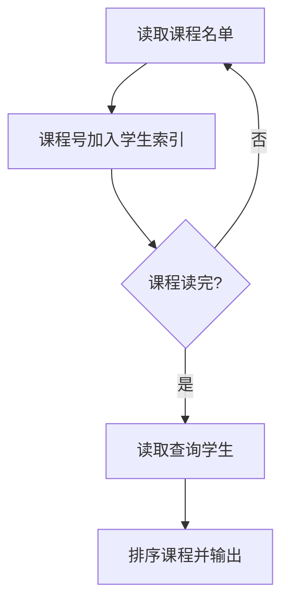
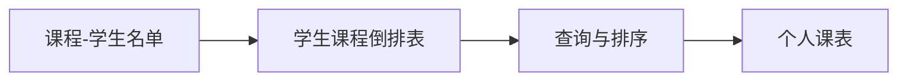

## 7-49 打印学生选课清单

- **分值：** 25分

## 题目描述

假设全校有最多40000名学生和最多2500门课程。现给出每门课的选课学生名单，要求输出每个前来查询的学生的选课清单。注意：每门课程的选课人数不可超过 200 人。

## 输入格式

输入的第一行是两个正整数：N（\le40000），为前来查询课表的学生总数；K（\le2500），为总课程数。此后顺序给出课程1到K的选课学生名单。格式为：对每一门课，首先在一行中输出课程编号（简单起见，课程从1到K编号）和选课学生总数（之间用空格分隔），之后在第二行给出学生名单，相邻两个学生名字用1个空格分隔。学生姓名由3个大写英文字母+1位数字组成。选课信息之后，在一行内给出了N个前来查询课表的学生的名字，相邻两个学生名字用1个空格分隔。

## 输出格式

对每位前来查询课表的学生，首先输出其名字，随后在同一行中输出一个正整数C，代表该生所选的课程门数，随后按递增顺序输出C个课程的编号。相邻数据用1个空格分隔，注意行末不能输出多余空格。

## 输入样例
```
10 5
1 4
ANN0 BOB5 JAY9 LOR6
2 7
ANN0 BOB5 FRA8 JAY9 JOE4 KAT3 LOR6
3 1
BOB5
4 7
BOB5 DON2 FRA8 JAY9 KAT3 LOR6 ZOE1
5 9
AMY7 ANN0 BOB5 DON2 FRA8 JAY9 KAT3 LOR6 ZOE1
ZOE1 ANN0 BOB5 JOE4 JAY9 FRA8 DON2 AMY7 KAT3 LOR6
```

## 输出样例
```
ZOE1 2 4 5
ANN0 3 1 2 5
BOB5 5 1 2 3 4 5
JOE4 1 2
JAY9 4 1 2 4 5
FRA8 3 2 4 5
DON2 2 4 5
AMY7 1 5
KAT3 3 2 4 5
LOR6 4 1 2 4 5
```

## 实现原理与解题思路

课程输入天然适合建立倒排索引：用 `student → 课程列表` 的映射保存每门课的选课学生。读完所有课程后，对每个查询学生取出并排序课程编号。

## 代码流程说明

逐门课程读取名单并把课程号加入每个学生的列表；查询时排序并输出。设选课记录数为 `R`，时间复杂度 `O(R + Q log Q)`（`Q` 为查询总课程数），空间复杂度 `O(R)`。

## 代码实现

```cpp
// 实现原理：
// 课程输入天然适合建立倒排索引：用 `student → 课程列表` 的映射保存每门课的选课学生。读完所有课程后，对每个查询学生取出并排序课程编号。
// 处理流程：
// 逐门课程读取名单并把课程号加入每个学生的列表；查询时排序并输出。设选课记录数为 `R`，时间复杂度 `O(R + Q log Q)`（`Q` 为查询总课程数），空间复杂度 `O(R)`。
#include <iostream>
#include <string>
#include <unordered_map>
#include <vector>
using namespace std;
int main() {
    ios::sync_with_stdio(false);
    cin.tie(nullptr);
    int n, k;
    cin >> n >> k;
    unordered_map<string, vector<int>> courses;
    for (int i = 1; i <= k; ++i) {
        int id, c;
        cin >> id >> c;
        string s;
        while (c--) {
            cin >> s;
            courses[s].push_back(id);
        }
    }
    while (n--) {
        string s;
        cin >> s;
        auto& v = courses[s];
        cout << s << ' ' << v.size();
        for (int x : v)
            cout << ' ' << x;
        cout << '\n';
    }
}
```

## 代码流程图



## 解题流程图



## 常见易错点

- 课程编号按输入课程顺序从 1 到 `K`。
- 查询输出课程号必须递增。
- 查询学生可能只选少量课程，不能输出课程名单中的其他学生。
