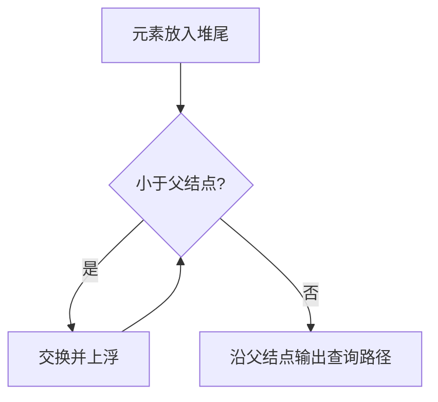

# 7-5 堆中的路径

- **分值：** 25分

## 题目描述

将一系列给定数字插入一个初始为空的最小堆 $h$。随后对任意给定的下标 $i$，打印从第 $i$ 个结点到根结点的路径。

## 输入格式

每组测试第 1 行包含 2 个正整数 $$n$$ 和 $$m$$ ($$\le 10^3$$)，分别是插入元素的个数、以及需要打印的路径条数。下一行给出区间 $[-10^4, 10^4]$ 内的 $$n$$ 个要被插入一个初始为空的小顶堆的整数。最后一行给出 $$m$$ 个下标。

## 输出格式

对输入中给出的每个下标 $i$，在一行中输出从第 $i$ 个结点到根结点的路径上的数据。数字间以 1 个空格分隔，行末不得有多余空格。

## 输入样例
```
5 3
46 23 26 24 10
5 4 3
```

## 输出样例
```
24 23 10
46 23 10
26 10
```

### 实现原理与解题思路

建立下标从 1 开始的小顶堆。插入时把元素放在末尾并不断上浮；查询下标 `i` 时反复输出 `h[i]`，再令 `i = i / 2` 回到父结点。

### 代码流程说明

1. 依次插入 `n` 个元素并维护堆序。
2. 对每个下标沿父结点输出到根。
3. 建堆复杂度 `O(n log n)`，每条路径 `O(log n)`，空间复杂度 `O(n)`。

### 代码实现

```cpp
// 实现原理：
// 建立下标从 1 开始的小顶堆。插入时把元素放在末尾并不断上浮；查询下标 `i` 时反复输出 `h[i]`，再令 `i = i / 2` 回到父结点。
// 处理流程：
// 1. 依次插入 `n` 个元素并维护堆序。 2. 对每个下标沿父结点输出到根。 3. 建堆复杂度 `O(n log n)`，每条路径 `O(log n)`，空间复杂度 `O(n)`。
#include <iostream>
#include <vector>
using namespace std;
int main() {
    ios::sync_with_stdio(false);
    cin.tie(nullptr);
    int n, m;
    cin >> n >> m;
    vector<int> h(n + 1);
    h[0] = -1000000007;
    for (int i = 1; i <= n; ++i) {
        cin >> h[i];
        for (int p = i; p > 1 && h[p] < h[p / 2]; p /= 2)
            swap(h[p], h[p / 2]);
    }
    while (m--) {
        int i;
        cin >> i;
        bool first = true;
        while (i) {
            if (!first)
                cout << ' ';
            cout << h[i];
            first = false;
            i /= 2;
        }
        cout << '\n';
    }
}
```

### 代码流程图



### 解题流程图


### 常见易错点

- 堆下标从 1 开始，父结点为 `i/2`。
- 输出顺序是查询结点到根。
- 上浮时比较父结点，不要误写成与子结点比较。
