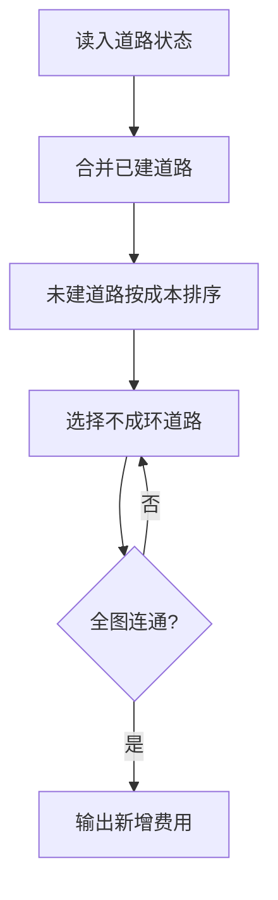

# 7-50 畅通工程之局部最小花费问题

- **分值：** 35分

## 题目描述

某地区经过对城镇交通状况的调查，得到现有城镇间快速道路的统计数据，并提出“畅通工程”的目标：使整个地区任何两个城镇间都可以实现快速交通（但不一定有直接的快速道路相连，只要互相间接通过快速路可达即可）。现得到城镇道路统计表，表中列出了任意两城镇间修建快速路的费用，以及该道路是否已经修通的状态。现请你编写程序，计算出全地区畅通需要的最低成本。

## 输入格式

输入的第一行给出村庄数目$$N$$ ($$1\le N \le 100$$)；随后的$$N(N-1)/2$$行对应村庄间道路的成本及修建状态：每行给出4个正整数，分别是两个村庄的编号（从1编号到$$N$$），此两村庄间道路的成本，以及修建状态 — 1表示已建，0表示未建。

## 输出格式

输出全省畅通需要的最低成本。

## 输入样例
```
4
1 2 1 1
1 3 4 0
1 4 1 1
2 3 3 0
2 4 2 1
3 4 5 0
```

## 输出样例
```
3
```

### 实现原理与解题思路

先把状态为 1 的道路并入并查集，它们不产生新增费用；再按成本升序处理状态为 0 的道路，合并不同分量并累加成本，即为含已有边的最小生成树。

### 代码流程说明

初始化并查集并合并已建道路，再排序未建道路并执行 Kruskal。若最终只有一个连通分量，输出费用。时间复杂度 `O(n² log n)`（输入边数为 `n(n-1)/2`），空间复杂度 `O(n²)`。

### 代码实现

```cpp
// 实现原理：
// 先把状态为 1 的道路并入并查集，它们不产生新增费用；再按成本升序处理状态为 0 的道路，合并不同分量并累加成本，即为含已有边的最小生成树。
// 处理流程：
// 初始化并查集并合并已建道路，再排序未建道路并执行 Kruskal。若最终只有一个连通分量，输出费用。时间复杂度 `O(n² log n)`（输入边数为 `n(n-1)/2`），
// 空间复杂度 `O(n²)`。
#include <algorithm>
#include <iostream>
#include <vector>
using namespace std;
struct Edge {
    int u, v, c, used;
};
struct DSU {
    vector<int> p;
    DSU(int n) : p(n + 1, -1) {}
    int find(int x) { return p[x] < 0 ? x : p[x] = find(p[x]); }
    bool unite(int a, int b) {
        a = find(a);
        b = find(b);
        if (a == b)
            return false;
        if (p[a] > p[b])
            swap(a, b);
        p[a] += p[b];
        p[b] = a;
        return true;
    }
};
int main() {
    ios::sync_with_stdio(false);
    cin.tie(nullptr);
    int n;
    cin >> n;
    vector<Edge> e(n * (n - 1) / 2);
    for (auto& x : e)
        cin >> x.u >> x.v >> x.c >> x.used;
    DSU d(n);
    for (auto x : e)
        if (x.used)
            d.unite(x.u, x.v);
    vector<Edge> todo;
    for (auto x : e)
        if (!x.used)
            todo.push_back(x);
    sort(todo.begin(), todo.end(), [](auto& a, auto& b) { return a.c < b.c; });
    long long ans = 0;
    for (auto x : todo)
        if (d.unite(x.u, x.v))
            ans += x.c;
    cout << ans << '\n';
}
```

### 代码流程图



### 解题流程图


### 常见易错点

- 已修道路要合并但不能重复计费。
- 未修道路仍需按成本排序。
- 并查集判断的是当前连通分量，不是是否存在直接道路。
