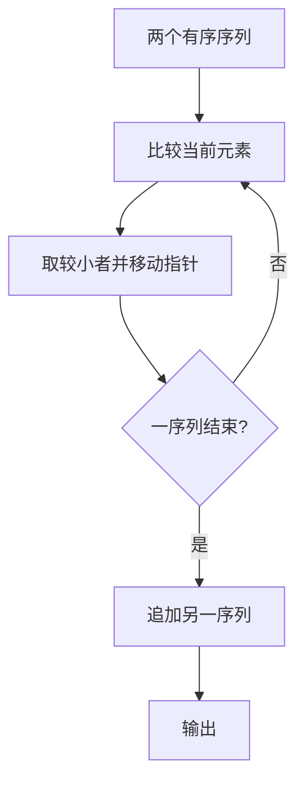
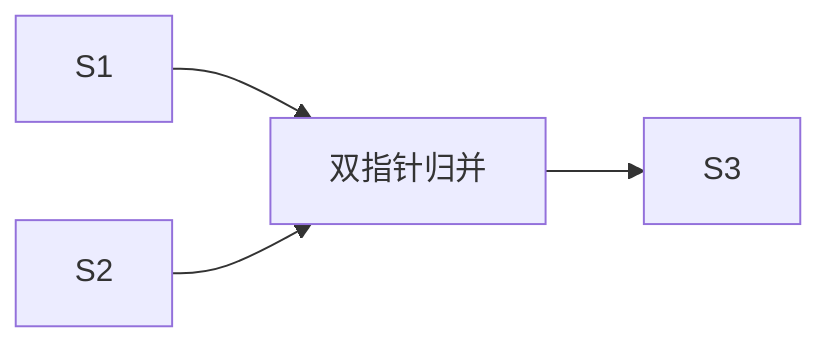

# 7-51 两个有序链表序列的合并

- **分值：** 20分

## 题目描述

已知两个非降序链表序列S1与S2，设计函数构造出S1与S2合并后的新的非降序链表S3。

## 输入格式

输入分两行，分别在每行给出由若干个正整数构成的非降序序列，用$$-1$$表示序列的结尾（$$-1$$不属于这个序列）。数字用空格间隔。

## 输出格式

在一行中输出合并后新的非降序链表，数字间用空格分开，结尾不能有多余空格；若新链表为空，输出`NULL`。

## 输入样例
```
1 3 5 -1
2 4 6 8 10 -1
```

## 输出样例
```
1 2 3 4 5 6 8 10
```

### 解题思路

用双指针分别指向两个非降序序列，比较当前值并将较小者加入结果；相等时取任意一个并继续，最后追加未耗尽序列。可以复用结点或直接输出/构造新链表。

### 代码流程说明

双指针归并，每个元素只访问一次，时间复杂度 `O(n+m)`，空间复杂度 `O(1)`（不计结果链表）。

### 代码实现

```cpp
#include <iostream>
#include <vector>
using namespace std;
vector<int> read(){vector<int>a;int x;while(cin>>x&&x!=-1)a.push_back(x);return a;}
int main(){ios::sync_with_stdio(false);cin.tie(nullptr);vector<int>a=read(),b=read(),c;size_t i=0,j=0;while(i<a.size()||j<b.size()){if(j==b.size()||(i<a.size()&&a[i]<=b[j]))c.push_back(a[i++]);else c.push_back(b[j++]);}if(c.empty())cout<<"NULL";else for(size_t k=0;k<c.size();++k){if(k)cout<<' ';cout<<c[k];}cout<<'\n';}
```

### 代码流程图



### 解题流程图



### 常见易错点

- `-1` 是结束标记，不能加入结果。
- 相等元素要保留两份，因为是合并而不是去重。
- 两个序列都为空时输出 `NULL`。
