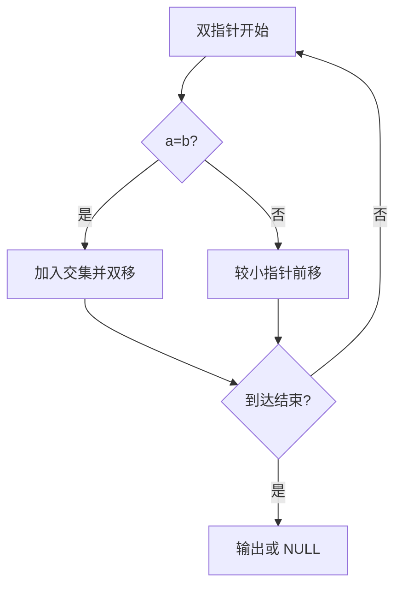
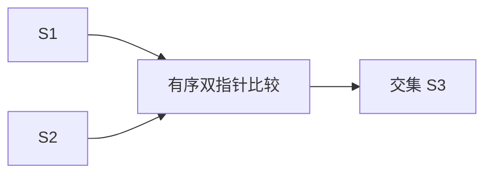

## 7-52 两个有序链表序列的交集

- **分值：** 20分

## 题目描述

已知两个非降序链表序列S1与S2，设计函数构造出S1与S2的交集新链表S3。

## 输入格式

输入分两行，分别在每行给出由若干个正整数构成的非降序序列，用$$-1$$表示序列的结尾（$$-1$$不属于这个序列）。数字用空格间隔。

## 输出格式

在一行中输出两个输入序列的交集序列，数字间用空格分开，结尾不能有多余空格；若新链表为空，输出`NULL`。

## 输入样例
```
1 2 5 -1
2 4 5 8 10 -1
```

## 输出样例
```
2 5
```

## 实现原理与解题思路

利用两个非降序序列的双指针。若值相等，加入交集并同时前进；较小者向前移动。扫描结束即得到交集，空交集输出 `NULL`。

## 代码流程说明

每个指针只向前移动，时间复杂度 `O(n+m)`，空间复杂度 `O(1)`（不计结果）。

## 代码实现

```cpp
// 实现原理：
// 利用两个非降序序列的双指针。若值相等，加入交集并同时前进；较小者向前移动。扫描结束即得到交集，空交集输出 `NULL`。
// 处理流程：
// 每个指针只向前移动，时间复杂度 `O(n+m)`，空间复杂度 `O(1)`（不计结果）。
#include <iostream>
#include <vector>
using namespace std;
vector<int> read() {
    vector<int> a;
    int x;
    while (cin >> x && x != -1)
        a.push_back(x);
    return a;
}
int main() {
    ios::sync_with_stdio(false);
    cin.tie(nullptr);
    vector<int> a = read(), b = read(), c;
    size_t i = 0, j = 0;
    while (i < a.size() && j < b.size()) {
        if (a[i] == b[j])
            c.push_back(a[i]), ++i, ++j;
        else if (a[i] < b[j])
            ++i;
        else
            ++j;
    }
    if (c.empty())
        cout << "NULL";
    else
        for (size_t k = 0; k < c.size(); ++k) {
            if (k)
                cout << ' ';
            cout << c[k];
        }
    cout << '\n';
}
```

## 代码流程图



## 解题流程图



## 常见易错点

- 交集中的重复值按两序列匹配次数保留。
- 只移动较小者，不能无条件同时移动。
- `-1` 不属于序列。
