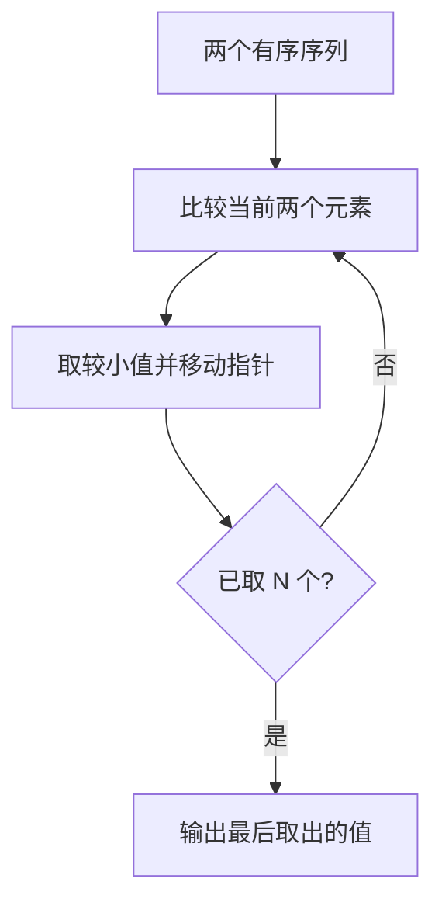
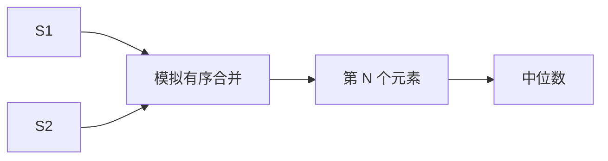

## 7-53 两个有序序列的中位数

- **分值：** 25分

## 题目描述

已知有两个等长的非降序序列S1, S2, 设计函数求S1与S2并集的中位数。有序序列A_0, A_1, \cdots, A_{N-1}的中位数指A_{(N-1)/2}的值,即第\lfloor(N+1)/2\rfloor个数（A_0为第1个数）。

## 输入格式

输入分三行。第一行给出序列的公共长度N（0<N\le100000），随后每行输入一个序列的信息，即N个非降序排列的整数。数字用空格间隔。

## 输出格式

在一行中输出两个输入序列的并集序列的中位数。

## 输入样例1
```
5
1 3 5 7 9
2 3 4 5 6
```

## 输出样例1
```
4
```

## 输入样例2
```
6
-100 -10 1 1 1 1
-50 0 2 3 4 5
```

## 输出样例2
```
1
```

## 实现原理与解题思路

两个序列等长且有序，不需要显式合并。使用双指针模拟合并过程，取出第 `N` 个元素（并集长度为 `2N`，题目定义的下标为 `N-1`），即为中位数。

## 代码流程说明

每次比较两个当前元素，移动较小者并递增计数；计数达到 `N` 时返回刚取出的值。时间复杂度 `O(N)`，额外空间复杂度 `O(1)`。

## 代码实现

```cpp
// 实现原理：
// 两个序列等长且有序，不需要显式合并。使用双指针模拟合并过程，取出第 `N` 个元素（并集长度为 `2N`，题目定义的下标为 `N-1`），即为中位数。
// 处理流程：
// 每次比较两个当前元素，移动较小者并递增计数；计数达到 `N` 时返回刚取出的值。时间复杂度 `O(N)`，额外空间复杂度 `O(1)`。
#include <iostream>
#include <vector>
using namespace std;
int main() {
    ios::sync_with_stdio(false);
    cin.tie(nullptr);
    int n;
    cin >> n;
    vector<int> a(n), b(n);
    for (int& x : a)
        cin >> x;
    for (int& x : b)
        cin >> x;
    int i = 0, j = 0, answer = 0;
    for (int k = 0; k < n; ++k) {
        if (i < n && (j == n || a[i] <= b[j]))
            answer = a[i++];
        else
            answer = b[j++];
    }
    cout << answer << '\n';
}
```

## 代码流程图



## 解题流程图



## 常见易错点

- 中位数是合并后第 `N` 个数，不是两个序列各自中位数的平均。
- 相等时取任一序列都不会影响结果。
- 指针越过一个序列后要直接取另一个序列。
