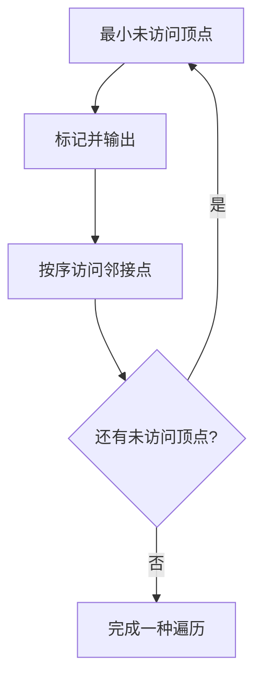
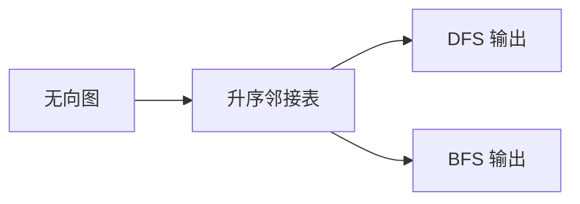

## 7-6 列出连通集

- **分值：** 25分

## 题目描述

给定一个有 $$n$$ 个顶点和 $$m$$ 条边的无向图，请用深度优先遍历（DFS）和广度优先遍历（BFS）分别列出其所有的连通集。假设顶点从 0 到 $$n-1$$ 编号。进行搜索时，假设我们总是从编号最小的顶点出发，按编号递增的顺序访问邻接点。

## 输入格式

输入第 1 行给出 2 个整数 $$n$$ ($$0<n\le 10$$) 和 $$m$$，分别是图的顶点数和边数。随后 $$m$$ 行，每行给出一条边的两个端点。每行中的数字之间用 1 空格分隔。

## 输出格式

按照"{ $$v_1$$ $$v_2$$ ... $$v_k$$ }"的格式，每行输出一个连通集。先输出 DFS 的结果，再输出 BFS 的结果。

## 输入样例
```
8 6
0 7
0 1
2 0
4 1
2 4
3 5
```

## 输出样例
```
{ 0 1 4 2 7 }
{ 3 5 }
{ 6 }
{ 0 1 2 7 4 }
{ 3 5 }
{ 6 }
```

## 实现原理与解题思路

使用邻接表保存无向图，并将每个顶点的邻接点按编号升序排列。第一次扫描用 DFS 输出连通集，第二次清空访问标记后用 BFS 输出连通集；每次从最小的未访问顶点开始。

## 代码流程说明

1. 双向加入所有边并排序邻接表。
2. 扫描顶点，递归 DFS 未访问邻接点。
3. 重置标记，用队列完成同样的 BFS 扫描。
4. 时间复杂度 `O(n+m)`（不含排序），空间复杂度 `O(n+m)`。

## 代码实现

```cpp
// 实现原理：
// 使用邻接表保存无向图，并将每个顶点的邻接点按编号升序排列。第一次扫描用 DFS 输出连通集，第二次清空访问标记后用 BFS 输出连通集；每次从最小的未访问顶点开始。
// 处理流程：
// 1. 双向加入所有边并排序邻接表。 2. 扫描顶点，递归 DFS 未访问邻接点。 3. 重置标记，用队列完成同样的 BFS 扫描。 4. 时间复杂度 `O(n+m)`（不含排序），
// 空间复杂度 `O(n+m)`。
#include <algorithm>
#include <iostream>
#include <queue>
#include <vector>
using namespace std;
int main() {
    ios::sync_with_stdio(false);
    cin.tie(nullptr);
    int n, m;
    cin >> n >> m;
    vector<vector<int>> g(n);
    while (m--) {
        int u, v;
        cin >> u >> v;
        g[u].push_back(v);
        g[v].push_back(u);
    }
    for (auto& e : g)
        sort(e.begin(), e.end());
    vector<bool> vis(n);
    auto dfs = [&](auto&& self, int v) -> void {
        vis[v] = true;
        cout << ' ' << v;
        for (int u : g[v])
            if (!vis[u])
                self(self, u);
    };
    for (int i = 0; i < n; ++i)
        if (!vis[i]) {
            cout << "{";
            dfs(dfs, i);
            cout << " }\n";
        }
    fill(vis.begin(), vis.end(), false);
    for (int i = 0; i < n; ++i)
        if (!vis[i]) {
            cout << "{";
            queue<int> q;
            q.push(i);
            vis[i] = true;
            while (!q.empty()) {
                int v = q.front();
                q.pop();
                cout << ' ' << v;
                for (int u : g[v])
                    if (!vis[u])
                        vis[u] = true, q.push(u);
            }
            cout << " }\n";
        }
}
```

## 代码流程图



## 解题流程图



## 常见易错点

- 无向边要加入两个方向。
- 入队前标记可避免同一顶点重复入队。
- DFS、BFS 都要按最小起点和升序邻接点访问。
