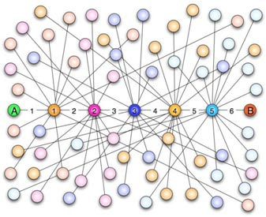
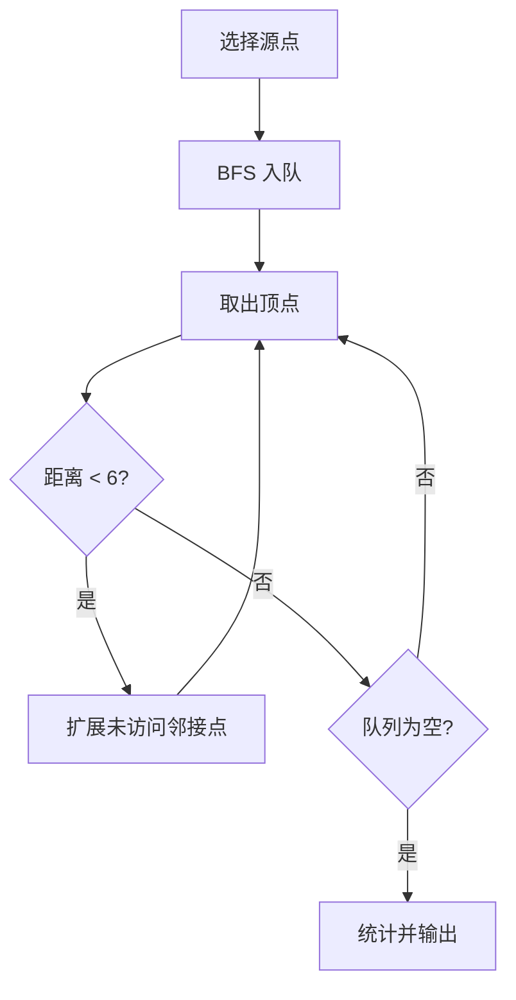

# 7-7 六度空间

- **分值：** 30分

## 题目描述

“六度空间”理论又称作“六度分隔（Six Degrees of Separation）”理论。这个理论可以通俗地阐述为：“你和任何一个陌生人之间所间隔的人不会超过六个，也就是说，最多通过五个人你就能够认识任何一个陌生人。”如图1所示。

<center>
<br>
图1  六度空间示意图</center>

“六度空间”理论虽然得到广泛的认同，并且正在得到越来越多的应用。但是数十年来，试图验证这个理论始终是许多社会学家努力追求的目标。然而由于历史的原因，这样的研究具有太大的局限性和困难。随着当代人的联络主要依赖于电话、短信、微信以及因特网上即时通信等工具，能够体现社交网络关系的一手数据已经逐渐使得“六度空间”理论的验证成为可能。

假如给你一个社交网络图，请你对每个节点计算符合“六度空间”理论的结点占结点总数的百分比。

## 输入格式

输入第1行给出两个正整数，分别表示社交网络图的结点数$$N$$（$$1<N\le 10^3$$，表示人数）、边数$$M$$（$$\le 33\times N$$，表示社交关系数）。随后的$$M$$行对应$$M$$条边，每行给出一对正整数，分别是该条边直接连通的两个结点的编号（节点从1到$$N$$编号）。

## 输出格式

对每个结点输出与该结点距离不超过6的结点数占结点总数的百分比，精确到小数点后2位。每个结节点输出一行，格式为“结点编号:（空格）百分比%”。

## 输入样例
```
10 9
1 2
2 3
3 4
4 5
5 6
6 7
7 8
8 9
9 10
```

## 输出样例
```
1: 70.00%
2: 80.00%
3: 90.00%
4: 100.00%
5: 100.00%
6: 100.00%
7: 100.00%
8: 90.00%
9: 80.00%
10: 70.00%
```

### 实现原理与解题思路

对每个顶点执行 BFS，记录最短距离。距离达到 6 的顶点计入结果但不再扩展；无向边要加入两个方向。

### 代码流程说明

1. 建立无向邻接表。
2. 以每个顶点为源点，将距离初始化为 `-1` 并入队。
3. 只扩展距离小于 6 的顶点，统计所有已访问顶点。
4. 输出占总人数的百分比。时间复杂度 `O(N(N+M))`，空间复杂度 `O(N+M)`。

### 代码实现

```cpp
// 实现原理：
// 对每个顶点执行 BFS，记录最短距离。距离达到 6 的顶点计入结果但不再扩展；无向边要加入两个方向。
// 处理流程：
// 1. 建立无向邻接表。 2. 以每个顶点为源点，将距离初始化为 `-1` 并入队。 3. 只扩展距离小于 6 的顶点，统计所有已访问顶点。 4. 输出占总人数的百分比。时间复杂度
// `O(N(N+M))`，空间复杂度 `O(N+M)`。
#include <iomanip>
#include <iostream>
#include <queue>
#include <vector>
using namespace std;
int main() {
    ios::sync_with_stdio(false);
    cin.tie(nullptr);
    int n, m;
    cin >> n >> m;
    vector<vector<int>> g(n + 1);
    while (m--) {
        int u, v;
        cin >> u >> v;
        g[u].push_back(v);
        g[v].push_back(u);
    }
    cout << fixed << setprecision(2);
    for (int s = 1; s <= n; ++s) {
        vector<int> d(n + 1, -1);
        queue<int> q;
        d[s] = 0;
        q.push(s);
        int count = 1;
        while (!q.empty()) {
            int v = q.front();
            q.pop();
            if (d[v] == 6)
                continue;
            for (int u : g[v])
                if (d[u] == -1)
                    d[u] = d[v] + 1, ++count, q.push(u);
        }
        cout << s << ": " << 100.0 * count / n << "%\n";
    }
}
```

### 代码流程图



### 解题流程图


### 常见易错点

- 源点自身也要计数。
- 距离为 6 时停止扩展，而不是排除该结点。
- 百分比用浮点计算并固定两位小数。
