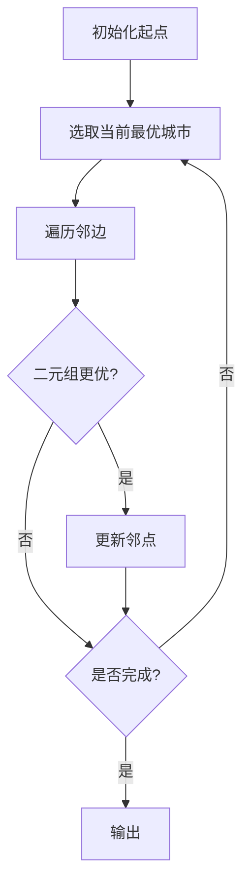

## 7-9 旅游规划

- **分值：** 25分

## 题目描述

有了一张自驾旅游路线图，你会知道城市间的高速公路长度、以及该公路要收取的过路费。现在需要你写一个程序，帮助前来咨询的游客找一条出发地和目的地之间的最短路径。如果有若干条路径都是最短的，那么需要输出最便宜的一条路径。

## 输入格式

输入说明：输入数据的第 1 行给出 4 个正整数 $$n$$、$$m$$、$$s$$、$$d$$，其中 $$n$$（$$2\le n\le 500$$）是城市的个数，顺便假设城市的编号为 0~($$n-1$$)；$$m$$ 是高速公路的条数；$$s$$ 是出发地的城市编号；$$d$$ 是目的地的城市编号。随后的 $$m$$ 行中，每行给出一条高速公路的信息，分别是：城市 1、城市 2、高速公路长度、收费额，中间用空格分开，数字均为整数且不超过 500。输入保证解的存在。

## 输出格式

在一行里输出路径的长度和收费总额，数字间以空格分隔，输出结尾不能有多余空格。

## 输入样例
```
4 5 0 3
0 1 1 20
1 3 2 30
0 3 4 10
0 2 2 20
2 3 1 20
```

## 输出样例
```
3 40
```

## 实现原理与解题思路

使用带二级目标的 Dijkstra。为每个城市维护 `(总长度, 总收费)`，比较时先比长度，长度相同再比收费；松弛时按同样的字典序更新。

## 代码流程说明

1. 建立双向道路图并初始化起点状态 `(0,0)`。
2. 选择尚未确定且二元组最小的城市。
3. 用经过该城市的候选状态松弛邻点。
4. 输出目的地状态。时间复杂度为 `O(n²+m)`，使用堆可降为 `O((n+m)log n)`；空间复杂度 `O(n+m)`。

## 代码实现

```cpp
// 实现原理：
// 使用带二级目标的 Dijkstra。为每个城市维护 `(总长度, 总收费)`，比较时先比长度，长度相同再比收费；松弛时按同样的字典序更新。
// 处理流程：
// 1. 建立双向道路图并初始化起点状态 `(0,0)`。 2. 选择尚未确定且二元组最小的城市。 3. 用经过该城市的候选状态松弛邻点。 4. 输出目的地状态。时间复杂度为
// `O(n²+m)`，使用堆可降为 `O((n+m)log n)`；空间复杂度 `O(n+m)`。
#include <functional>
#include <iostream>
#include <queue>
#include <tuple>
#include <vector>
using namespace std;
struct Edge {
    int to, len, fee;
};
int main() {
    ios::sync_with_stdio(false);
    cin.tie(nullptr);
    int n, m, s, dest;
    cin >> n >> m >> s >> dest;
    vector<vector<Edge>> g(n);
    while (m--) {
        int u, v, l, c;
        cin >> u >> v >> l >> c;
        g[u].push_back({v, l, c});
        g[v].push_back({u, l, c});
    }
    const int INF = 1e9;
    vector<pair<int, int>> d(n, {INF, INF});
    priority_queue<tuple<int, int, int>, vector<tuple<int, int, int>>,
                   greater<tuple<int, int, int>>>
        pq;
    d[s] = {0, 0};
    pq.push({0, 0, s});
    while (!pq.empty()) {
        auto [len, fee, v] = pq.top();
        pq.pop();
        if (d[v] != make_pair(len, fee))
            continue;
        for (auto e : g[v]) {
            pair<int, int> cand = {len + e.len, fee + e.fee};
            if (cand < d[e.to])
                d[e.to] = cand, pq.push({cand.first, cand.second, e.to});
        }
    }
    cout << d[dest].first << ' ' << d[dest].second << '\n';
}
```

## 代码流程图



## 解题流程图


## 常见易错点

- 必须长度优先、费用次优。
- 道路是双向关系时要加入两个方向。
- 长度相同也要执行费用比较并更新。
